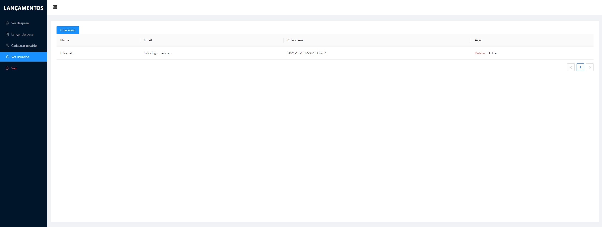

# Sistema de lançamentos de despesas e receitas

    

## Prévia

##### em desenvolvimento

## Sobre

Sistema que estou desenvolvendo para ajudar minha esposa (💙) no seu atual emprego onde ela precisa fazer alguns lançamentos em planilhas e depois exportar os dados em PDF e XLS.
Achei interessante deixar o projeto aberto caso alguém queira usar para algum outro fim, esta super editavél.

## Principais funções / Roadmap

- [x] Login
- [x] Cadastro de usuários - em andamento
- [x] Listar usuários - em andamento
- [x] Editar usuários - em andamento
- [x] Lançar despesas
- [ ] Lançar receitas
- [ ] Cadastrar pessoas
- [ ] Cadastrar status
- [ ] Cadastrar funcionarios
- [ ] Cadastrar Operações
- [ ] Cadastrar serviços
- [x] Relatorio de despesa
- [x] Exportar despesa em PDF
- [x] Exportar despesa em XLS
- [x] Filtros e buscas em relatorios
- [ ] Filtros e buscas no excel
- [ ] Pagina de 404

## Rodando

- Clone o projeto

- Instale as dependências

- Crie um `.env` com base no `.env.example`.

- Rode em modo de desenvolvimento com: `yarn dev`

## Tecnologias utilizadas

- [Typescript](https://www.typescriptlang.org/)
- [NextJS](https://nextjs.org/)
- [Next Auth](https://next-auth.js.org/)
- [Prisma ORM](https://www.prisma.io/)
- [Material Table](https://material-table-core.com/)
- [Ant Design](https://ant.design/)
- [SWR](https://swr.vercel.app/)
- [Vercel (cloud)](https://vercel.com)
- [Heroku (Postgres)](https://heroku.com/)

### Made with 💙 in Bahia, Brasil.

